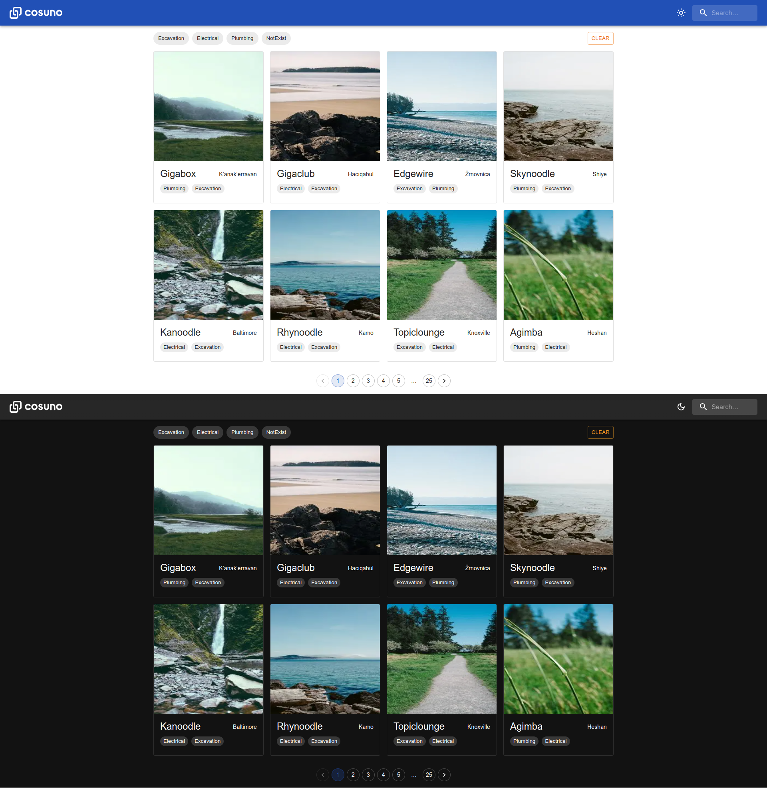

# Cosuno Demo App

This project built using Next.js framework.



## Online Demo

You can access an online deployment for this project from the following URL:

https://cosuno.vercel.app

## Docs
- [API](docs/API.md)
- [Enhancements](docs/ENHANCEMENTS.MD)

## Requirements
- Node.js
- Node Package Manager (**NPM**)
- Yarn (optional)


## Setup for local Development
### Installation
Use the package manager [npm](https://npmjs.com) to install the requirements:

```bash
npm install
# or
yarn
```

Run the project in development mode:
```bash
npm run dev
# or
yarn dev
```

Open http://localhost:3000 with your browser to see the result.

### Build
Build production:
```bash
npm run build
# or
yarn build
```

Start your production build locally:
```bash
npm run start
# or
yarn start
```


## Docker Installation

Start dockerized application:
```bash
docker compose up
```

Open http://localhost:3003 with your browser to see the result.

## Contributing
Pull requests are welcome. For major changes, please open an issue first to discuss what you would like to change.
